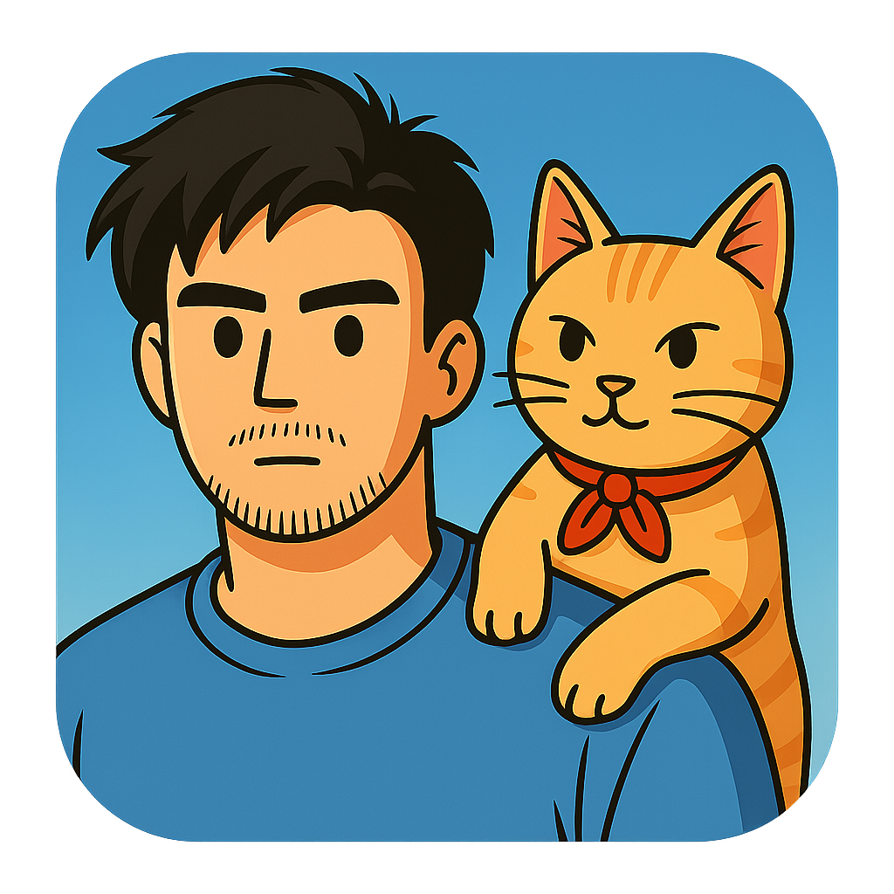

<p align="center">
  
</p>

<h1 align="center">⚡️ On-Call Cat</h1>

<p align="center">
  <b>Automate incident tracking, Slack triage, and Notion updates — effortlessly.</b><br>
  A lightweight <code>@slack/bolt</code> and <code>@notionhq/client</code> powered assistant for modern teams.
</p>

---

## Overview

**On-Call Cat** streamlines the process of handling on-call incidents in Slack by automatically parsing specially formatted messages (using the `@auto` syntax), validating key fields, and syncing updates directly into Notion.

No more manual copy-pasting — just type `@auto` in Slack and let the bot take care of the rest.

---

## Features

- **Smart message parsing:** Extracts structured data like priority, issue, customer, replication steps, etc.
- **Rich text handling:** Automatically strips Slack formatting (bold, italic) from field values while preserving email links.
- **ASAP date support:** Use "ASAP" as a shorthand for "20 minutes from now" in date fields.
- **Multi-channel support:** Monitor multiple Slack channels, each routing to different Notion databases (or many-to-one).
- **Notion integration:** Automatically creates or updates corresponding pages in your Notion database.
- **Message edit support:** Edit your Slack message and the corresponding Notion page updates automatically.
- **Thread awareness:** Responds only to top-level messages (or optionally to threads).
- **Validation feedback:** Instantly replies if required fields are missing or have type errors.
- **Schema detection:** Dynamically matches your Notion DB schema without hardcoding.
- **Rate limiting:** Throttles Notion API calls to 3 requests/second to prevent rate limit errors.
- **Timeout protection:** 10-second timeout on API calls with graceful error handling.
- **Health monitoring:** Built-in health check and metrics endpoints for observability.
- **Graceful shutdown:** Proper cleanup on SIGTERM/SIGINT for zero-downtime deployments.
- **Structured logging:** JSON logs with Pino for production-ready observability.
- **Socket Mode ready:** Runs seamlessly via Slack Socket Mode for instant responsiveness.

---

## Architecture

```shell
Slack Message (@auto) 
    ↓
Bolt App (Socket Mode)
    ↓
Parser & Validator
    ↓
Rate Limiter (3 req/s) → Timeout Protection (10s) → Notion API
    ↓
Notion Database (Create/Update Page)
    ↓
Success/Error Response to Slack Thread
```

**Flow:**

1. **Slack** users post messages starting with `@auto` (or edit existing messages).
2. **Bolt App** listens via Socket Mode and extracts the message.
3. **Parser** extracts key-value pairs from the message text.
4. **Validator** checks for required fields and type correctness.
5. **Schema Cache** provides Notion DB schema (cached for 1 hour by default).
6. **Rate Limiter** throttles requests to prevent API abuse.
7. **Timeout Protection** ensures API calls complete within 10 seconds.
8. **Notion API** creates or updates the corresponding database entry.
9. **Response** posted to Slack thread with success confirmation or error details.

---

## Configuration

### Channel Monitoring Modes

On-Call Cat supports two modes for monitoring Slack channels:

#### **Single-Channel Mode (Default)**

Monitor one Slack channel and write to one Notion database.

```env
CHANNEL_DB_MAPPINGS=false
WATCH_CHANNEL_ID=C1234567890
NOTION_DATABASE_ID=abc123def456ghi789
```

#### **Multi-Channel Mode**

Monitor multiple Slack channels, each routing to potentially different Notion databases. This mode reads configuration from a `channel-mappings.json` file.

```env
CHANNEL_DB_MAPPINGS=true
# Optional: Custom path (defaults to ./channel-mappings.json)
CHANNEL_DB_MAPPINGS_FILE=/path/to/mappings.json
```

**channel-mappings.json format:**

```json
{
  "databases": [
    {
      "databaseId": "abc123def456ghi789",
      "description": "On-Call Issue Tracker - Main",
      "channels": [
        {
          "channelId": "C1234567890",
          "description": "#eng-pmo-lobby"
        },
        {
          "channelId": "C0987654321",
          "description": "#on-call-bot-test"
        }
      ]
    },
    {
      "databaseId": "xyz789uvw456rst123",
      "description": "Secondary Issue Tracker",
      "channels": [
        {
          "channelId": "C5555555555",
          "description": "#support-team"
        }
      ]
    }
  ]
}
```

This configuration allows:
- **One database → Many channels** (multiple channels write to the same database)
- **Many databases** (different channels route to different databases)
- **Self-documenting** with optional description fields for clarity

### Notion Database Requirements

Your Notion database must include at least one of these properties for message tracking:

- **Slack Message URL** (URL or Text type) - Stores the permalink to the Slack message
- **Slack Message TS** (Text or Number type) - Stores the message timestamp (canonical identifier)

The bot will auto-detect these columns by name. If neither exists, message updates won't work.

### Required Environment Variables

| Variable | Description | Required |
|-----------|-------------|----------|
| SLACK_BOT_TOKEN | Bot token from your Slack App | YES |
| SLACK_APP_LEVEL_TOKEN | App-level token for Socket Mode | YES |
| SLACK_SIGNING_SECRET | Slack signing secret (optional if using Socket Mode only) | OPTIONAL |
| NOTION_TOKEN | Notion API integration token | YES |
| CHANNEL_DB_MAPPINGS | Enable multi-channel mode (true/false, default: false) | OPTIONAL |
| CHANNEL_DB_MAPPINGS_FILE | Path to channel mappings JSON (default: ./channel-mappings.json) | OPTIONAL |
| WATCH_CHANNEL_ID | Slack channel ID to monitor (single-channel mode only) | YES (single-channel) |
| NOTION_DATABASE_ID | Target Notion database ID (single-channel mode only) | YES (single-channel) |
| ALLOW_THREADS | Allow parsing inside threads (true/false, default: false) | OPTIONAL |
| API_TIMEOUT | Timeout for API calls in ms (default: 10000) | OPTIONAL |
| SCHEMA_CACHE_TTL | Schema cache TTL in ms (default: 3600000 = 1 hour) | OPTIONAL |
| HEALTH_PORT | Port for health check server (default: 1987) | OPTIONAL |
| PORT | Port for main app (default: 1987) | OPTIONAL |
| LOG_LEVEL | Logging level: trace, debug, info, warn, error (default: info) | OPTIONAL |

Store these in `.env` or a secret manager (Doppler, Vault, etc).

---

### Invite the bot in your target channel

`/invite @On-Call Cat`

## Running Locally

### Step 1: Install dependencies

```shell
npm install
```

### Step 2: Create `.env`

**Single-channel mode:**

```shell
# Required
SLACK_BOT_TOKEN=xoxb-...
SLACK_APP_LEVEL_TOKEN=xapp-...
NOTION_TOKEN=secret_...
NOTION_DATABASE_ID=abc123def456
WATCH_CHANNEL_ID=C123456789
CHANNEL_DB_MAPPINGS=false

# Optional
ALLOW_THREADS=false
API_TIMEOUT=10000
SCHEMA_CACHE_TTL=3600000
HEALTH_PORT=1987
PORT=1987
LOG_LEVEL=info
```

**Multi-channel mode:**

```shell
# Required
SLACK_BOT_TOKEN=xoxb-...
SLACK_APP_LEVEL_TOKEN=xapp-...
NOTION_TOKEN=secret_...
CHANNEL_DB_MAPPINGS=true

# Optional
CHANNEL_DB_MAPPINGS_FILE=./channel-mappings.json
ALLOW_THREADS=false
API_TIMEOUT=10000
SCHEMA_CACHE_TTL=3600000
HEALTH_PORT=1987
PORT=1987
LOG_LEVEL=info
```

Then create `channel-mappings.json` (see Configuration section above for format).

### Step 3: Start the app

```shell
npm start
```

You should see:
⚡️ On-Call Cat running (Socket Mode)

---

## Example Slack Message

**Creating a new incident:**

```shell
@auto  
Priority: P1  
Issue: Production API timeout on checkout  
How to replicate: Attempt to purchase via /checkout  
Customer: Acme Corp  
1Password: support+k1893@acme.com
Needed by: ASAP
Relevant Links: <https://status.acme.io>, <https://notion.so/acme-api>
```

**Notes:**
- **Email formatting:** The bot automatically handles Slack's email formatting (e.g., `*<mailto:user@domain.com|user@domain.com>*`)
- **ASAP dates:** Use `ASAP` for urgent issues - it sets "Needed by" to 20 minutes from now
- **Rich text:** Bold (`*text*`) and italic (`_text_`) formatting is automatically stripped from all fields except "Reported by (text)"

**Updating an incident:** Simply edit your original message - the bot will detect the change and update the corresponding Notion page automatically!

---

## How It Works

### Core Components

| Component | Responsibility | Location |
|------------|----------------|----------|
| **BotMetrics** | Tracks success/failure metrics with encapsulated state | `lib/metrics.js` |
| **NotionSchemaCache** | Caches Notion DB schema with TTL-based auto-refresh | `lib/schema-cache.js` |
| **parseAutoBlock()** | Extracts key-value pairs from Slack messages | `lib/parser.js` |
| **normalizeEmail()** | Strips Slack formatting from emails (handles `*<mailto:...>*`) | `lib/parser.js` |
| **stripRichTextFormatting()** | Removes bold/italic markers while preserving URLs | `lib/parser.js` |
| **parseNeededByString()** | Parses dates including "ASAP" (20 min from now) | `lib/parser.js` |
| **missingFields()** | Validates that all required data is present | `lib/validation.js` |
| **typeIssues()** | Validates field types (dates, priorities, emails, etc.) | `lib/validation.js` |
| **loadChannelMappingsFromFile()** | Loads multi-channel configuration from JSON | `lib/config.js` |
| **getDatabaseIdForChannel()** | Routes channel messages to appropriate Notion database | `lib/config.js` |
| **createOrUpdateNotionPage()** | Creates or updates Notion pages dynamically | `app.js` |
| **findPageForMessage()** | Finds existing pages by Slack TS (ensures idempotent updates) | `app.js` |
| **getSchema()** | Retrieves cached Notion DB schema, auto-refreshes when expired | `app.js` |

### Modular Architecture

The codebase follows a hybrid functional/OO approach:
- **Stateful components** (metrics, cache) use classes with private fields
- **Pure functions** (parsers, validators) remain functional for testability
- **Configuration** centralized in `lib/config.js`
- **Constants** extracted to `lib/constants.js` for maintainability

---

## Tech Stack

- **Slack Bolt JS** (v3.18.0) - Slack app framework with Socket Mode
- **Notion SDK** (v2.2.15) - Official Notion API client
- **Validator** (v13.12.0) - RFC-compliant email validation
- **Node.js 20** - Alpine-based Docker image
- **Pino** - High-performance structured JSON logging
- **p-throttle** - Rate limiting (3 req/s to Notion API)
- **p-timeout** - Timeout protection for API calls
- **ES Modules** - Modern JavaScript module system

---

## Development

Run linter:

```shell
npm run lint
npm run lint:fix  # Auto-fix issues
```

Run tests:

```shell
npm test                  # Run all tests
npm run test:parser       # Parser tests only
npm run test:validation   # Validation tests only
```

Check syntax:

```shell
node --check app.js
```

---

## Monitoring & Health Checks

### Unified Health Check System

Check system status for both local and GCP environments with our modular OO architecture:

```shell
# Local environment checks (Docker, Node.js, Filesystem, Ports)
npm run health:local

# GCP environment checks (Cloud Run, Deploy, Build)
npm run health:gcp

# Watch mode with live updates
npm run health:watch           # GCP
npm run health:watch:local     # Local

# JSON output for CI/CD and automation
npm run health:json            # GCP
npm run health:json:local      # Local
```

**Dashboard sections:**
- **[APP]** Application health with real-time metrics and channel configuration
- **[CR]** Cloud Run service status, scaling, and resources (GCP only)
- **[CD]** Cloud Deploy pipeline state and rollout progress (GCP only)
- **[CB]** Recent build history with success/failure tracking (GCP only)
- **[GIT]** Version sync between local and deployed code
- **[DOCKER]** Docker status and container health (local only)
- **[NODE]** Node.js environment and dependencies (local only)
- **[FS]** Filesystem checks for required files (local only)
- **[PORT]** Port availability checks (local only)

**Features:**
- Modular OO design with extensible checkers and renderers
- Real Slack channel names (fetched via API)
- Real Notion database titles
- Success rate warnings (< 95%)
- Smart URL truncation + terminal hyperlinks
- Animated cat in watch mode

See [docs/HEALTH_CHECKS.md](docs/HEALTH_CHECKS.md) for complete documentation.

### CLI Context & Flags Precedence

All ops/infra scripts use a unified context resolver:

- Precedence: flags > gcloud config > environment
- Example invocations:

```shell
# Prefer explicit flags (especially in CI)
node infrastructure/setup-infrastructure.mjs --project <PROJECT_ID> --region us-central1

# Or rely on gcloud config (no flags)
gcloud config set project <PROJECT_ID>
node infrastructure/setup-infrastructure.mjs --region us-central1

# DRY_RUN to preview actions
DRY_RUN=1 node scripts/ops.mjs preflight --target=gcp
```

Unified commands (via `scripts/ops.mjs` and `scripts/check-health.mjs`):

- `npm run logs -- [--target=local|gcp] [--follow] [--include-requests]`
- `npm run health:local` | `npm run health:gcp` (explicit target selection)
- `npm run health:watch` | `npm run health:watch:local` (live monitoring)
- `npm run health:json` | `npm run health:json:local` (JSON output)
- `npm run deploy` | `npm run deploy:list` | `npm run deploy:status`
- `npm run preflight` (Slack + IAM + pipeline checks)

### HTTP Health Endpoints

The bot also exposes direct HTTP endpoints:

#### Health Check Endpoint

```shell
curl http://localhost:1987/health
```

**Response (healthy):**

```json
{
  "status": "healthy",
  "uptime": 3600.5,
  "lastActivity": "2025-11-06T10:30:00.000Z",
  "metrics": {
    "messagesProcessed": 42,
    "messagesCreated": 30,
    "messagesUpdated": 12,
    "messagesFailed": 2,
    "validationErrors": 5,
    "apiTimeouts": 1,
    "rateLimitHits": 0,
    "notionErrors": 1,
    "uptimeSeconds": 3600,
    "successRate": "95.24%"
  }
}
```

#### Metrics Endpoint

```shell
curl http://localhost:1987/metrics
```

Returns detailed metrics in JSON format with success rates and uptime.

## Logs

Unified, colorized logs are available locally and on GCP with the same format.

- Local logs (pretty):

```shell
npm run logs -- --target=local          # recent logs
npm run logs -- --target=local --follow # stream logs
```

- GCP logs (pretty via Cloud Logging):

```shell
# Recent logs (stdout-only by default, best for app logs)
npm run logs -- --target=gcp

# Stream logs
npm run logs -- --target=gcp --follow

# Include Cloud Run request logs (in addition to stdout)
npm run logs -- --target=gcp --include-requests
```

Behavior and defaults:
- `--target` defaults to `gcp` if not specified.
- GCP non-follow reads use `--freshness=1h` and `--limit=50`.
- GCP reads default to stdout-only (excludes request logs) unless `--include-requests` is passed.
- Follow mode uses `gcloud logging tail`; non-follow uses `gcloud logging read` with batched pretty-printing.

---

## 🐳 Deployment

### Local / Docker Deployment

```shell
npm run build
npm run start
npm run logs

# Expect: "⚡️ On-Call Cat running (Socket Mode)"
```

### Google Cloud Platform (Cloud Run)

Deploy to GCP Cloud Run for production-ready, auto-scaling serverless deployment.

#### Quick Start

**New users:** Follow the step-by-step guide in [GETTING_STARTED.md](GETTING_STARTED.md)

**Already deployed?** Just push to main (ensure Cloud Build trigger is configured):

```shell
git push origin main     # Auto-deploys to staging
```

**Benefits:**
- Push to main → automatic build and deploy

**Features:**
- Automated staging → production pipeline with approval gates
- Infrastructure as code (no manual console configuration)
- Docker builds with caching for fast deployments
- Rollback support and release tracking

**Documentation:**
- [GETTING_STARTED.md](GETTING_STARTED.md) - First-time deployment checklist
- [infrastructure/README.md](infrastructure/README.md) - Operations and reference

Notes:
- Cloud Build triggers require connecting your GitHub repo in Cloud Build → Triggers.
- Cloud Deploy expects `clouddeploy.yaml` and `skaffold.yaml` to be valid; verify region and project IDs.
- Service must listen on port `1987` (standardized across app and health).

---

## Local Development

Run locally with Docker (npm convenience):

```shell
npm run start
npm run logs
```

Or run directly with Node.js (requires environment variables):

```shell
npm install
npm start
```

### Other Deployment Platforms

- **Docker**: Use provided `Dockerfile` and `docker-compose.yml`
- **Fly.io**: `fly launch` and configure secrets
- **Railway**: Connect repo and set environment variables
- **AWS ECS**: Use Dockerfile with ECS/Fargate

---

## Folder Structure

```shell
on-call-cat/
├── app.js                        # Main application entry point
├── package.json                  # Dependencies and scripts
├── Dockerfile                    # Container image definition
├── docker-compose.yml            # Docker Compose configuration
├── cloudbuild.yaml               # GCP Cloud Build configuration
├── manifest.json                 # Slack app manifest
├── channel-mappings.json.example # Example multi-channel config
├── docs/                         # Documentation
│   ├── GCP_DEPLOYMENT.md         # Comprehensive GCP deployment guide
│   ├── GCP_QUICK_REFERENCE.md    # Quick command reference
│   ├── SETUP_FLOW.md             # Deployment wizard flow diagram
│   └── SCRIPT_FLAGS.md           # Script flags and selective execution
├── scripts/                      # Utility scripts
│   ├── ops.mjs                   # Unified CLI (start, stop, logs, deploy, preflight)
│   ├── check-health.mjs          # Health check entry point (unified local/GCP)
│   ├── check-health.test.mjs     # Health check smoke tests
│   ├── pretty-gcp-logs.mjs       # GCP log formatter
│   ├── pretty-gcp-logs.test.mjs  # Log formatter tests
│   ├── lint-no-emoji.mjs         # Emoji linting tool
│   └── cat-demo.mjs              # ASCII cat animation demo
├── lib/                          # Modular components
│   ├── config.js                 # Centralized configuration & multi-channel routing
│   ├── constants.js              # App-wide constants (defaults, regexes)
│   ├── metrics.js                # BotMetrics class for tracking
│   ├── parser.js                 # Message parsing, email normalization, date parsing
│   ├── parser.test.js            # Unit tests for parser functions
│   ├── validation.js             # Field validation functions
│   ├── validation.test.js        # Unit tests for validation functions
│   ├── schema-cache.js           # NotionSchemaCache class with TTL
│   ├── ascii-icons.js            # Centralized icon library
│   ├── ascii-art.js              # ASCII cat frames and animations
│   └── health-check/             # Health check system (OO architecture)
│       ├── health-checker.mjs    # Base class for checkers
│       ├── renderer.mjs          # Base class for renderers
│       ├── config.mjs            # Health check configuration
│       ├── formatters.mjs        # Shared formatting utilities
│       ├── checks/               # 7 modular health checkers
│       │   ├── git-check.mjs
│       │   ├── app-health-check.mjs
│       │   ├── gcp-check.mjs
│       │   ├── docker-check.mjs
│       │   ├── node-check.mjs
│       │   ├── filesystem-check.mjs
│       │   └── port-check.mjs
│       └── renderers/            # 3 flexible renderers
│           ├── terminal-renderer.mjs
│           ├── json-renderer.mjs
│           └── watch-renderer.mjs
├── logo/                         # Brand assets
│   ├── on-call-cat.png           # Main logo
│   └── on-call-cat-2.png         # Small logo variant
└── README.md                     # This file
```

---

## Troubleshooting

### Common Issues

**"Failed to load Notion schema" error**
- Verify `NOTION_TOKEN` has access to the database
- Check `NOTION_DATABASE_ID` is correct
- Ensure the Notion integration is connected to the database (Share → Add connection)

**"I couldn't write to Notion due to insufficient permissions"**
- Open the database in Notion as a full page
- Click **Share** → **Add connections** → Select your integration
- Grant **Can edit** access

**"Request timed out" errors**
- Default timeout is 10 seconds - increase with `API_TIMEOUT=15000`
- Check your network connection to Notion API
- Verify Notion API status at status.notion.so

**Bot doesn't respond to messages**
- In single-channel mode: Verify `WATCH_CHANNEL_ID` matches the channel
- In multi-channel mode: Check `channel-mappings.json` includes the channel
- Invite the bot to the channel: `/invite @On-Call Cat`
- Check bot has `channels:history` and `channels:read` scopes
- Ensure Socket Mode is enabled in Slack app settings

**Message edits don't update Notion**
- Verify your Notion database has "Slack Message URL" or "Slack Message TS" property
- Check the property type is URL/Text (for URL) or Text/Number (for TS)
- Original message must have been successfully created first

**High validation error rate**
- Check the example message format matches your Notion schema
- Required fields are case-insensitive but must match property names
- Date formats: ISO-8601, natural language (e.g., "2025-11-07 17:00 PT"), or "ASAP"
- Emails: RFC-compliant format, supports +, -, numbers, and dots

**Email validation failing**
- Bot handles Slack's email formatting automatically (e.g., `*<mailto:user@domain.com|user@domain.com>*`)
- Supports complex emails like `support+k1893@domain.com`
- Check that the email follows RFC 5322 format

---

## 🤝 Contributing

1. Fork  
2. Create a branch (git checkout -b feature/awesome)  
3. Commit (git commit -am "Add awesome feature")  
4. Push and open a PR  

---

## License

MIT © 2025 — Francisco

---

<p align="center">
  <sub>Built with 💙 by humans (and cats) who hate manual Notion updates.</sub><br>
  
</p>
